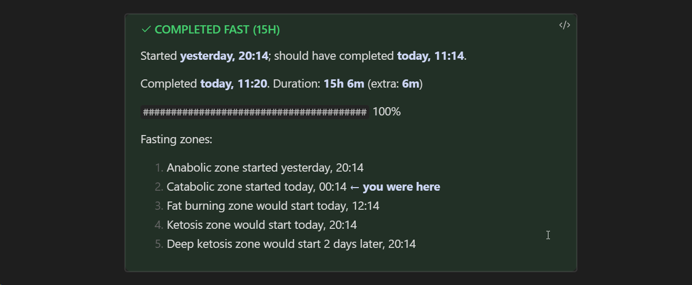

I just implemented [Fastimer](notes/obsidian-fastimer)'s rendering through callouts: this is an Obsidian mechanic that allows you to turn an ordinary quote into a designed block of text that attracts the reader's attention. You've probably seen blocks like “advice” and “pay attention” — these are callouts.

You can read more in [Obsidian Help](https://help.obsidian.md/Editing+and+formatting/Callouts). 

As a result, the timer now takes on a different color depending on the state: blue for an active fast, green for completed, and red for a failed one.

In addition, I made the text more compact and worked on styling:

It turned out to be way nicer than the block of preformatted text as it was before.