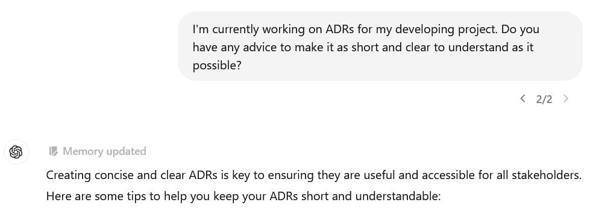

When ChatGPT remembers a detail from a conversation for the future, it displays a "Memory updated" badge above its response. Like, got it:

Every time I see it, it makes me smile because it instantly reminds me of [The Walking Dead](https://store.steampowered.com/app/207610/The_Walking_Dead/) and the meme “Clementine will remember that”. In that game, the characters surrounding the protagonist would remember his decisions, and it would influence their behavior. This included Clementine — a girl the main character saved at the beginning of the game.

In the game, this mechanic was honestly implemented in a rather mediocre way, but when it comes to ChatGPT — it works. The attention to detail is so strong that sometimes I have to remind myself that I’m talking to a language model, not an extraordinarily attentive and very knowledgeable person.