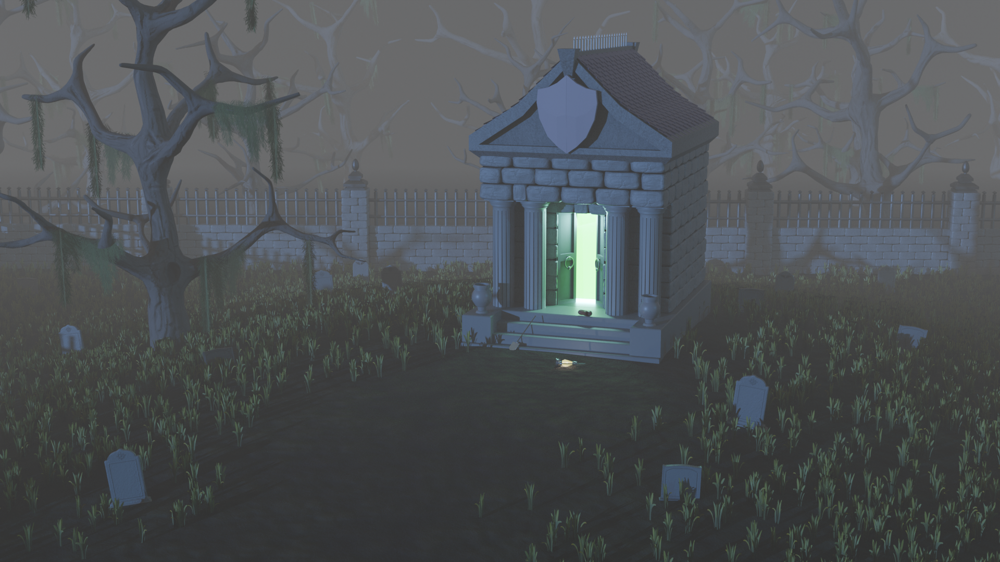

Still learning 3D in my free time. Here's my first somewhat independent project after finishing a [course](https://www.udemy.com/course/blender-environments-megacourse-create-3d-environments/) recently.

https://youtu.be/mraGFR_Tr5k

Of course, there are plenty of issues: the models, the colors, the composition... Honestly, pretty much everything. Good thing the scene is set at night with fog, so it's easy to hide the worst spots. I wouldn't be surprised if the course creators picked this setting on purpose to keep beginners from getting too discouraged :)

That said, I'm happy with the result. At this stage, perfectionism feels more like an enemy than a friend. And hey, it’s definitely better than my last attempt! Back then, I was totally green in Blender and scared to deviate even slightly from the instructor: ten minutes of watching, ten minutes of copying.

That approach works at the very beginning, but it doesn't help you learn how to solve problems. This time, I watched a few lessons back-to-back for about an hour or two, then tried to figure things out on my own. I only went back to the videos when I was completely stuck. Feels like I’m actually retaining a lot more this way.

Long story short, the thing is done. On to the next one!
