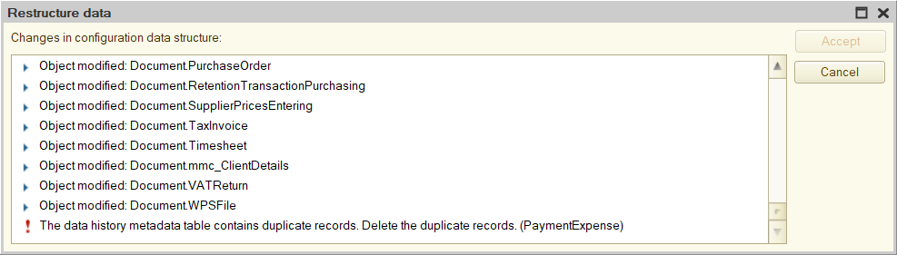

Once again, I came across a nasty bug when the platform broke the data history metadata table.

Outwardly, it looks like this: you update the database configuration, and when you try to restructure, the error “The data history metadata table contains duplicate records. Delete the duplicate records” pops up. The platform does not offer any clear way to find such records.

The problem can be solved at the database level. The table referenced by the error is _DataHistoryMetadata. It contains metadata versions of each object for which data history is being maintained. This allows the platform to understand what attributes the object had at any point in time if the data history is maintained for the object.

How does it work? Well, when the list of an object’s attributes changes (for example, an attribute was added to the catalog), the platform writes its metadata: specifically, it adds a new entry to _DataHistoryMetadata and stores in it the current list of object attributes, as well as the version number of this list (for example, when history is enabled for an object, the first version of metadata is saved, when adding some attribute, the second version is saved, and so on).

The platform also puts a mark in the created record that this particular version of the object is the most actual, and then removes this mark from the version that was marked as actual before.

So, the problem is that the platform sometimes forgets to take the last step, and two versions appear in the table at once, marked as current. The Designer understands this but cannot do anything.

The solution follows from the algorithm above: you need to find conflicting versions and revoke the mark of actuality from the one that is older. It is better to use queries: data history is often enabled for a bunch of objects, and the list of their attributes is constantly changing — in general, there will be so many versions in the table that the devil will break his leg.

If you also encountered this problem and are therefore reading this text, you can use the [queries](https://gist.github.com/vkostyanetsky/6496c67e2b2fd3d064c4cafd16da0b79) that I wrote:

1. get-issues.sql checks that there is an issue: it looks for metadata versions that are also marked as actual.
2. fix-issues.sql removes the actuality mark from those versions that are actually outdated.

Both queries are written for Microsoft SQL Server. If you use PostgreSQL, then [here they are](https://gist.github.com/vkostyanetsky/75665ce04247e900743604eb386d1889) for this DBMS.

The queries will require a slight adaptation to a specific database: they use the _fld626 field, which is the data separator. In your _DataHistoryMetadata table, this field may be called differently, so you need to update its name to the current one. It will be difficult to make a mistake — the table has only one field with the _fld prefix.

P.S. Please bear in mind that the license agreement prohibits access to the database, bypassing the platform’s tools, so you can only go for such experiments if there are no other options left.