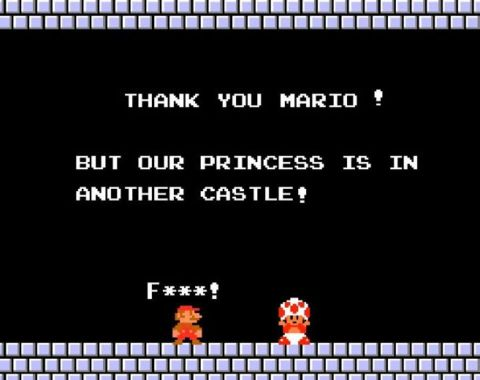

I already wrote about the error mentioned in this post’s title [earlier](/notes/date-literal-exceeds-3999), but here's the refresher: the platform chokes on dates later than the year 3999 (things start blowing up at 3999-12-01, I guess). In theory, dates like that should never make it into the database in the first place. In practice... Well, thanks to bugs in application code — and in the platform itself — they sometimes do.

The usual symptoms are pretty random and annoying: some reports stop working, some documents refuse to post, totals recalculation crashes, and so on. Basically, any code that touches records with those broken dates is now having a bad day.

The fix I outlined in the post linked above does work, but it's relatively slow: you need to configure the tech log, collect the output, and then parse it. The problem is that the platform crashes the moment it touches the first bad date, and there may be lots of them scattered across different tables. So you often end up doing this in multiple passes: run a check, hit an error, fix it, run again, hit the next one, repeat.

A few years ago, because I wanted a faster way to deal with this, I wrote a [PostgreSQL query](https://gist.github.com/vkostyanetsky/a58ff201d2a87a35e70c4c8f4112ad4c) for it. The idea is simple:

1. Find all date fields in the database.
2. Build one giant query against those fields to look for dates beyond 1C's limit.

So yes, this query generates another query. Very normal behavior. Run the generated query, and you get the full picture: a list of tables containing invalid dates. After that, it's just engineering work — inspect the tables and decide what to do. In our case, bad dates sometimes show up in totals and turnovers, so we can just delete those rows and recalculate totals using the standard tools.

Why do this at the DBMS level? Because 1C itself can't really help here — as a reminder, the platform crashes as soon as it touches the bad records. That includes reads, not just writes. Also, in this case, going directly against the database is simply faster and more convenient.

The other day I rewrote the same [query for MS SQL](https://gist.github.com/vkostyanetsky/5990a16caacc4a9057b577c6a5694512). It turned out longer — because, well, MS SQL likes to make you earn it — but the idea is exactly the same.

If you want to use it, keep this in mind:

- The `_Fld626` field in the query text is the Fresh separator. In your database it may have a different name, or it may not exist at all.
- The query is written for a database that uses a 2000-year offset. If your database does not use that offset, you'll need to adjust the condition accordingly — see `DATEADD()`.
- I added the XML output trick (`FOR XML`) to stop SSMS from truncating the generated mega-query. That seemed faster than messing around with type casts. The side effect is that before running the generated query, you need to replace `&gt;` with `>`.
