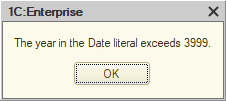

So, during a routine totals recalculation from the Configurator, we suddenly got the error: "the year in the Date literal exceeds 3999". Which means there's a date somewhere in the database — or trying to get there — that is beyond the maximum 1C can handle: 31.12.3999 23:59:59.

Alright. What do we do with that?

The main thing is to identify the exact table that contains the bad dates. Since the error showed up during totals recalculation, the obvious place to look is the registers. Open the standard totals management tool, start recalculation, and [you'll get](totals.png) the name of the register the platform trips over.

Another approach — more proper, methodologically speaking — is to enable tech log collection (`SDBL`, `EXCP`, and `EXCPCNTX`) and get a log that looks roughly like [this](excp.log). In that log, find the `EXCP` event, and right before it the `SDBL` event. That `SDBL` entry contains the SQL query that caused the crash. In its text, you'll see the table name you need (`AccumRgTn11530`). The corresponding configuration object name can be pulled out with pretty much any utility built around `GetDBStorageStructureInfo()`.

One way or another, you end up with the register name. Open its form, sort by period, and you'll quickly get to the [bad entries](entries.png). Then the job is to inspect the documents that created those records, fix the root cause, and repost the documents. If totals recalculation is still broken after that, then either this is not the only table with broken dates, or those dates have already spread somewhere beyond the records table.

For example, I once had a case where fixing the records was not enough, because records with invalid dates were still sitting in the turnover table. The platform itself could not remove them, but the database was small enough that I could get away with some restructuring tricks. I pulled the following stunt: turned off the "Use in totals" flag for all register dimensions and applied the changes; then turned it back on and recalculated totals again. As a result, the register's turnover table was physically dropped, then recreated and filled from scratch — this time without dates from the distant future.

As a last resort, you could delete the bad records with direct SQL queries (`DELETE` or even `TRUNCATE`). But first, that violates the platform vendor's license agreement, and second, it's risky: it's very easy to remove something important and not notice until later. So I would, uh, not recommend trying that at home.
