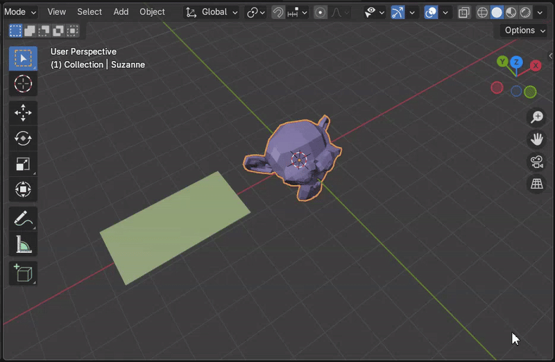
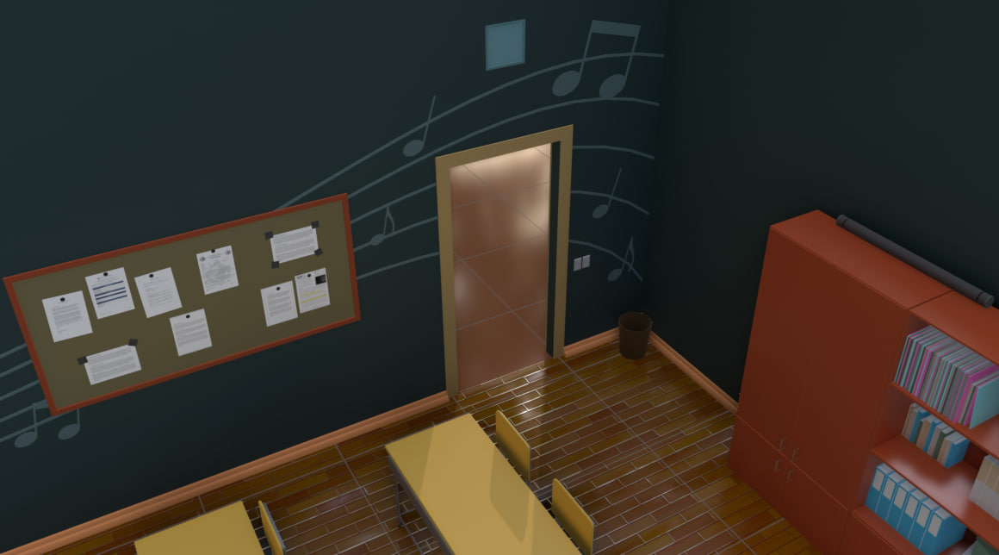

I figured out a cool trick for cutting off parts of an object when it intersects with something else. Like, in this gif, there’s a monkey head model in the center, and as a plane moves through it, the part that intersects just disappears.

[The idea](https://github.com/vkostyanetsky/3DPlayground/blob/main/Geometry%20Nodes/DeleteGeometry.blend) is pretty simple: you shrink the geometry of the "cutter" object down to a cube, get its min and max coordinates along each axis, and then for every point on the object you're trimming, you check whether it falls within that range. If it does — boom, it gets deleted.

There are tons of ways you could use this. For example, I used it to automatically trim parts of decorative music staff lines on a wall so they wouldn't go across a doorway.

Sure, you could do it by hand, without geometry nodes, but that would kill flexibility. If the wall size, door size, or the angle of the lines changes — you'd have to redo everything from scratch.