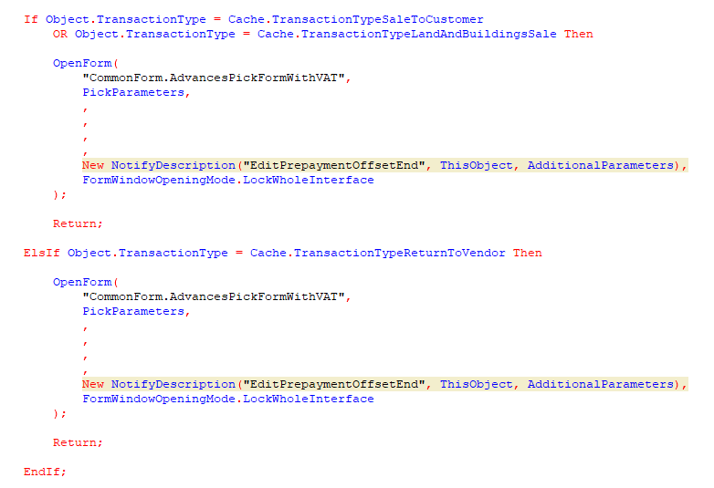

If the type of operation is the sale of goods or real estate, then open the common form AdvancesPickFormWithVAT with the parameters defined in the PickParameters structure. The callback is EditPrepaymentOffsetEnd method, defined in the same module; pass it the AdditionalParameters structure. The form needs to be opened so that it locks the whole interface.

However, if the type of operation is a return to the supplier, then open the general form AdvancesPickFormWithVAT with the parameters defined in the PickParameters structure. The callback is the EditPrepaymentOffsetEnd method, defined in the same module; pass it the AdditionalParameters structure. The form needs to be opened so that it locks the whole interface.

I hope you won't confuse.