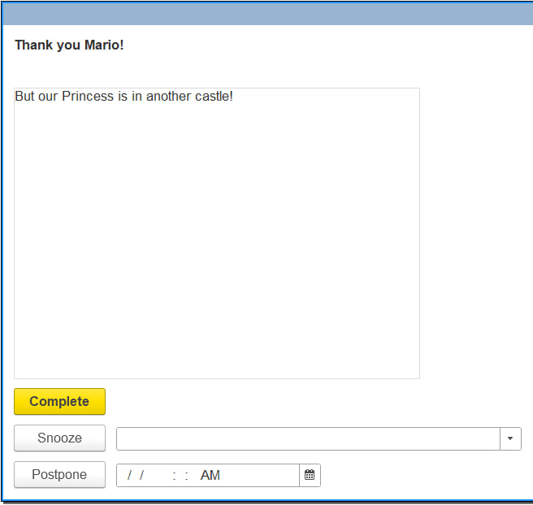



A couple of Easter eggs hidden inside FirstBit ERP. They're tucked away for the developers: in the first case, users see just the form title and notification text, while in the second, they see the standard "waiting for connection" message.

I like to add little things like this from time to time — it helps to keep things fun, even when the task isn’t the most exciting or I’m just feeling tired. If you haven’t checked out Bystronovsky’s "[Design Without Stress](https://collab.ldwg.ru/stressless-design)", you really should — no way I could explain it better myself.

By the way, here’s another Easter egg! Not from our ERP this time, but from a new tool we’re making for automated database updates. We're building it just for ourselves, so we can joke around with the user a bit :)

