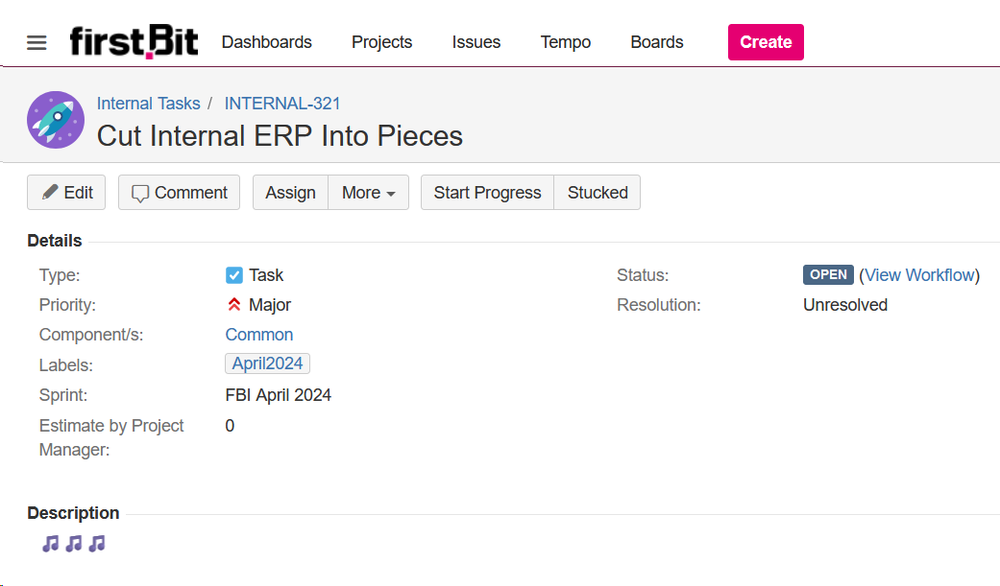

Recently, we came up with the idea of dividing the internal ERP into several independent parts and organizing data exchange between them. We discussed the outlines of the task, the exchange model, transport, and roughly agreed on deadlines — in general, we did what we usually do.

I created a task for the stuff. We give them names in English, so I wrote in the first wording that came to mind.

The title came out with sound. Okay, this one is funny, but what should I call it then? Well, let it be Distributed Internal ERP. Abbreviated... DIE?

I let the first one be. Long live Papa Roach :)