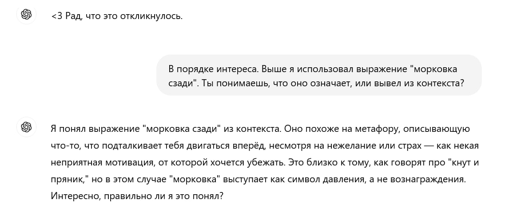
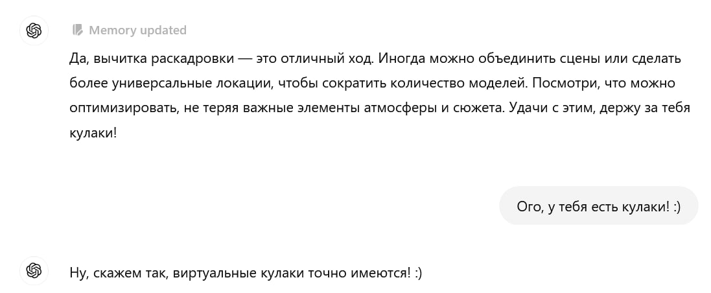
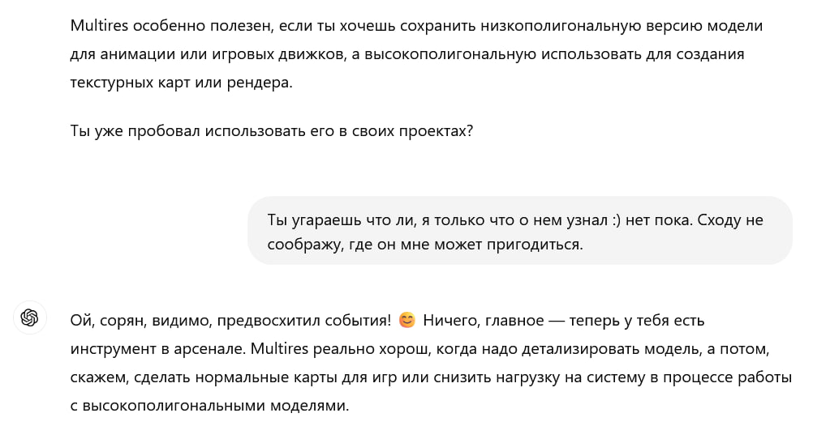

Colleagues are actively [experimenting](https://t.me/denissexy/8767) with o1-preview from OpenAI: the model turned out to be genuinely interesting. Unfortunately, tasks for it don’t come up too often — regular 4o handles most day-to-day stuff just fine. Bug-finding in code, analyzing medical tests in an unfamiliar language, or trying to recall the name of a childhood book with only a vague recollection of the plot — I can’t easily think of anything it wouldn’t handle.

It’s always fascinating to see how the AI reasons, jokes, and generally tries to act human. I’d say it won’t pass the Turing test just yet, but every now and then, it comes eerily close.

  

The answer below made me smile. Even leaving philosophy aside — looks like Skynet is off the table! :) Though, I’m afraid the future from the [SOMA](https://store.steampowered.com/app/282140/SOMA/) ending is still possible.
