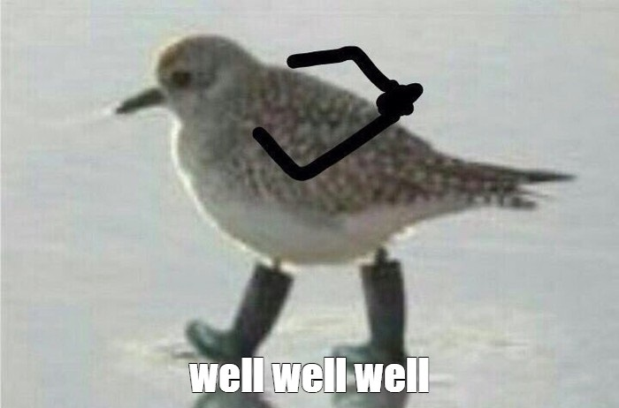

As soon as I [removed](/notes/no-more-google-fonts/) Google Fonts from my blog, I had to remove embedded tweets as well.

How did it work before? I want to link a tweet — I simply insert the link to it. The build script replaces it with an HTML block, then Twitter founds this block and replaces it with the text of the tweet (and some useful links as well). This [commit](https://github.com/vkostyanetsky/BlogBuilder/commit/c21ef8a7bec10672406e6be57b8e734ba3ac01c5) shows you how it worked.

How does it work now? You're right, it does not! Twitter is blocked in Russia, so its javascript works with VPN enabled only.

The solution: I had to screen all the tweets that I once referred to and add them to the notes in the form of pictures with links. Whoever needs the original will turn on VPN and go to Twitter, and the rest, at least, can read the text.

A few words about the technical side. I was too lazy to screen each tweet manually, so I was thinking about how to automate the process. At first, I came across only services that were ready to solve the problem for some pathetic ten dollars (thanks guys, maybe, one day…), but then I came across the perfect [tool](https://github.com/privatenumber/snap-tweet): a console script for Node.js.

Nothing that you don't need. Pure functionality. You give a tweet to it. It gives you a picture back:

> npx snap-tweet https://twitter.com/PossumEveryHour/status/1506148678461014016

That's all. I want to donate the author, really.

I thought about attaching snap-tweet to my build script (so that it would be like before: I insert a link to a tweet, and then it generates a picture by itself and puts it where it needs to be). Decided that I'm not gonna do it. Rude violation of KISS, and indeed… There's enough entropy in the world so far. Especially now.