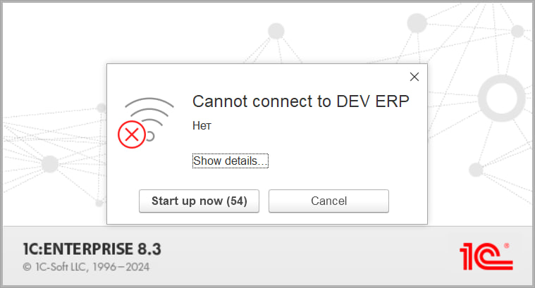



This is the message the current platform throws up when you try to connect to an offline server cluster. I do appreciate minimalism in interfaces, of course, but this is definitely over the top.

What's more, the platform is installed with only a single language pack (English) and even launched with a hard override to "Ven VLen", yet somehow the native birches still manage to sprout up. Maybe the C++ library that fires off the message (DataExchangeTcpClientImpl.cpp) is looking at the OS language (Russian) in my case — hard to say.

Anyway, I can't shake the Bugs Bunny vibes every time I see that dialog box.

