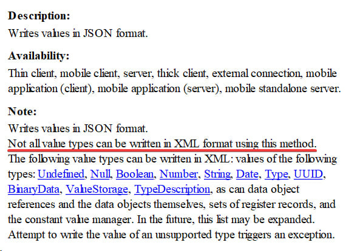

This commentary in the documentation for the WriteJSON() method of XDTOSerializer is enviably deep, I would say:

Well, yes. The method dumps data into JSON, not XML. So it’s hard to argue that not all value types can be packed into XML using it (to be precise, none). Such a pity that there is an obvious copy-paste from the help for WriteXML() further in the text! I almost decided that it was an Easter egg from the developers :)