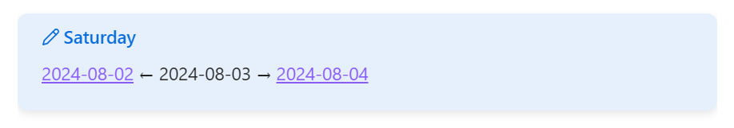

When you're actively working in daily notes in Obsidian, you often want to quickly peek into the note from yesterday or, conversely, for tomorrow. For example, when sorting today's tasks and wanting to postpone some of them for tomorrow.

I'm too lazy to type the exact date every time, so I wrote a [script](https://gist.github.com/vkostyanetsky/6c70f00b817157f9b6e62ee89bade853) for this. It takes the note's date from its title (expects it to be in <abbr title="2024-08-17, for example.">ISO 8601</abbr> format) and generates a tooltip with links to yesterday's and tomorrow's notes. The day of the week is displayed in the header for additional convenience:

The script is written for the [Dataview](https://github.com/blacksmithgu/obsidian-dataview) plugin since I'm already using it for other tasks. In general, it can easily be adapted for [Templater](https://github.com/SilentVoid13/Templater), [CustomJS](https://github.com/saml-dev/obsidian-custom-js), or even turned into a standalone plugin (again, I'm too lazy to bother with that).

If you plan to use it:

1. In the noteLink() function, specify the path to your daily notes folder (currently, the path contains a 'Days' folder for example; I mean the path is indicated in the Daily notes/Template file location setting);
2. Include the script in your daily note template (Daily notes/Template file location setting).
