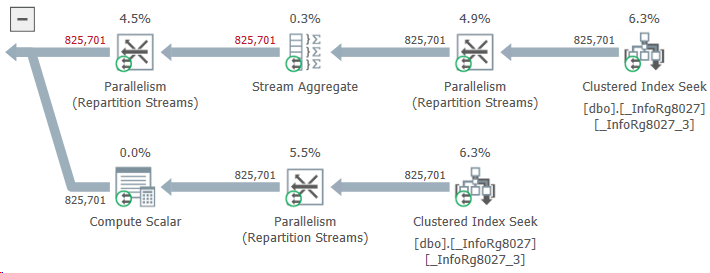

One query more, one query less - it doesn’t matter, people often say. Like, the main thing is that the query must be cheap: it doesn’t read too much, gets into the index, and so on.

This point of view makes sense, but mindlessly machine-gunning queries is a dangerous idea. Even if everything looks good at the moment, the system may change slightly in the future. And then a seemingly harmless patch will burn your production server to the ground right on Friday.

Let me tell you about one example from recent practice. There is an ERP that contains a table with payment stages for customer orders. One of these stages is prepayment; until it is received, you cannot create an order for the supplier.

Technically, the purchase order simply stores the customer's order ID; if the field is filled (that is, if the purchase order is created by the customer's order), ERP needs to read the payment stages of the customer's order and understand whether the purchase can be made.

It sounds elementary, but monitoring shows that the operation is slow as hell and eats up memory as if it were the last time. 

Welp, let's go find out. We saw something like this:

What do we have here? Instead of taking two or three stages of payment for an order, ERP receives almost a million! How this could be possible?

It turned out that the problem was with those purchase orders that were not related to customer orders at all. The developer considered that the logic for them could not be changed: the customer’s order ID is empty and the query will not find payment stages for this ID. This means that the same result will be obtained as if there were no query at all. And an extra query - well... One query more, one query less... Not a big deal.

The deal turned out to be big. The table of payment stages contained data not only for customer orders, but also for other types of documents. Their customer order ID field was empty. As a result, ERP, when trying to find payment stages using an empty customer order ID, unexpectedly found them.

The query read about a gigabyte of data and wrote it to a temporary table. A gigabyte was read, then a gigabyte was written... History hit the disk, the DBMS buffer cache, and other components of the system (even the network, which had to drive this gigabyte back and forth without any benefit).

Do you know what I think? If the result of a query is known, there is probably no need to do it after all.