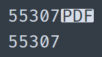

I get a ticket: the client can’t log into the customer portal. I check the database — the account is fine. So what’s the problem? I check the login and see a strange sight:

Above is what’s in the database, and below is what the user entered. My first thought: how on earth did a document end up in the string? :D

I’ll skip the further investigation. The key here is asking the right questions (otherwise, both Google and AI will be thinking about the popular file format, not the symbol). So, PDF in the context of Unicode means Pop Directional Formatting! It’s a symbol that controls text direction; it’s needed, for example, to properly render Arabic (which can contain both left-to-right and right-to-left text).

In short, it was a one-call problem. However, I’d like to point out that the PDF file format existed long before this symbol. I get that these are different technical fields, and the developers probably didn’t see the overlapping terminology as a significant issue. But deep down, I’m sure someone was smirking, anticipating today’s confusion.