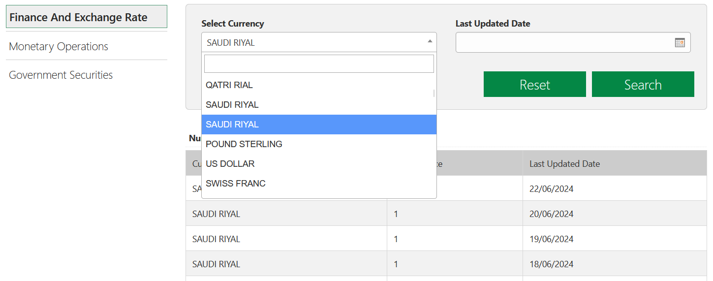

Is it possible to love your country's currency more than the people of Saudi Arabia? It is a rhetorical question: the answer is no.

I'm currently looking at the [website](https://www.sama.gov.sa/en-US/FinExc/Pages/Currency.aspx) of their central bank. The country's currency is the Saudi riyal, and the Central Bank sets rates for other currencies in relation to it. Consequently, there is no point in asking the bank for the rate of the riyal itself. However, the website calmly suggests choosing it twice:

For your information, the first option breaks the website, and the second one pedantically displays “1” for any date.

Another funny thing: colleagues seem to store currency names as 14-character strings. Otherwise, it is difficult to explain why, according to their data, Canada uses not the Canadian dollar but CANADIAN DOLLA, and Romania uses mysterious NEW ROMANIAN L instead of its leu. However, these two are rather lucky: Singapore, for example, conducts payments in SINGAPORE DOLL.