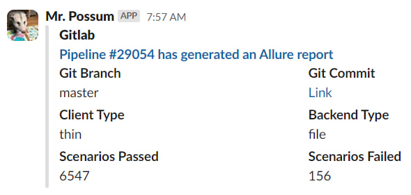

I found a [script](https://gist.github.com/vkostyanetsky/b0807f2df2501bbeeb97c95a977f3e23) that I wrote a couple of years ago for our work GitLab. In short, we run our development repository through a barrage of tests on Vanessa daily, resulting in a nice report showing how many tests passed, which ones failed, the reasons for failures, and so on.

The report needs to be analyzed regularly, at least at a glance. Of course, we haven’t seen fully "green" tests in a long time, and that’s expected: for example, in the case of interdependent development, commits can break the checked functionality, and the tests still need adjustments. However, keeping a pulse on it is still essential.

To simplify this routine, I expanded the pipeline code a bit: after generating the report, GitLab first creates a brief summary (client type, database type, test statistics) and sends it to Slack.

As a bonus, it’s now easier to answer the philosophical question, "who broke everything". Most often, it’s the author of the first commit on which the Scenarios Failed metric in the screenshot above hit the ceiling :)
