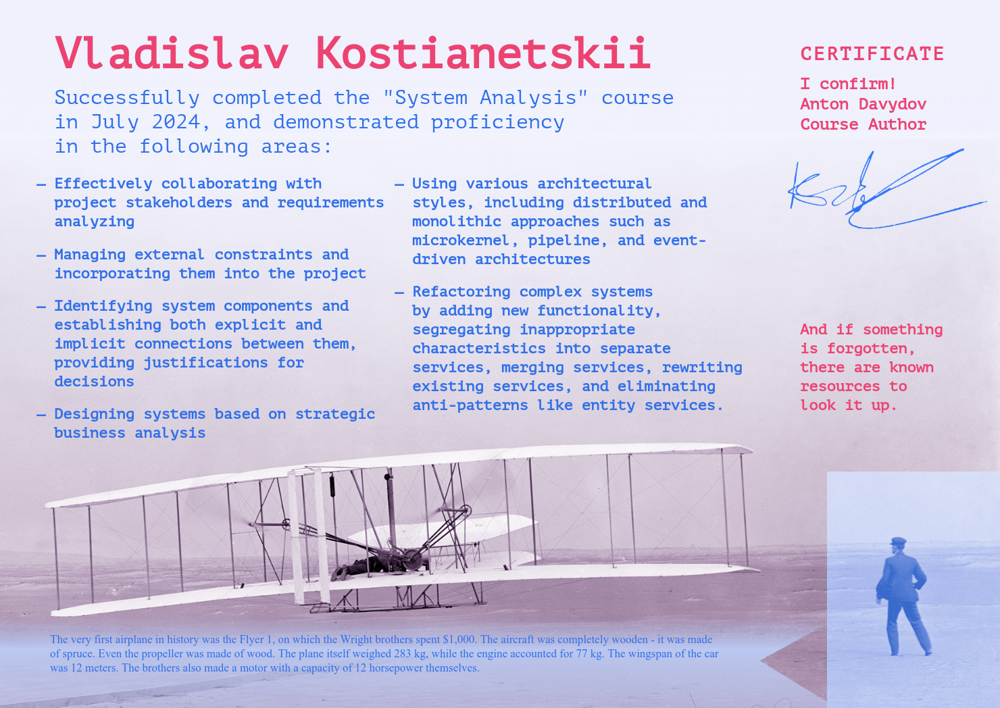

Amidst all these pet projects and the August whirlwind, I forgot to mention that I completed a [course](https://tough-dev.school/system-analysis) on system analysis, which I recently [wrote about](/notes/ibrahim).

The course was structured so that throughout the sessions, we worked on the same system, identifying problems and gradually solving them. Before the first lesson, we were asked to design the initial version of the system so that we could compare it with the final version at the end of the course and assess our progress. Well, I’m happy with the comparison — I mean, it’s really hard to look at that first version without laughing (or crying) :)

There wasn’t much time for reflection during the course, so I plan to continue working on the materials and turning the lessons into personal notes. It’s not that simple, given that our company deals heavily with solutions based on 1C:Enterprise, and much of my work involves various integrations of 1C instances with solutions outside the 1C stack.

However, 1C instances can be considered as monoliths with a specific set of characteristics (depending on the tasks being solved within them), and in most other respects, communication with them doesn’t differ much from traditional solutions: the same events (like RabbitMQ), the same incoming/outgoing HTTP calls, the same instability metric, and so on.

At this point, I’m definitely adopting (or have already adopted):

1. Breaking down the technical specifications into numbered items (US-XXX) and storing them in one place with tags like "updated at," "canceled at," etc. This format seems quite effective.
2. Maintaining an ADR (Architecture Decision Record). I’ve already implemented this, actually. However, it’s a bit concerning that some items occasionally get stored there that aren’t strictly architectural (e.g., logging principles for certain sections). Still, such things seem crucial for decision-making.
3. Event Storming as a way to visualize business processes. I can’t say it’s a huge improvement over the patchwork we used before, but the result looks nice, and having a standard is better than having none.
4. Application service diagrams with stickers indicating each service's characteristics. This is quite functional when you need to look at the project from a high level, and it’s not as dry as endless tables. That way, if the bus factor kicks in, the next person is more likely to notice these details.
5. I want to work on BPMN and Activity Diagrams. I like the format, but so far, my attempts haven’t been satisfactory. I’ll keep trying.
6. The concept of separating functionality to reduce dependencies unexpectedly resonated with me. It used to seem simpler to combine similar functionalities to reduce code volume, but now it seems this approach increases complexity and internal cohesion, potentially causing more harm than good.

Overall, I’m very satisfied with the course. It seems like the best investment of effort over the past year. If you’re thinking of taking it but are unsure — go for it :)