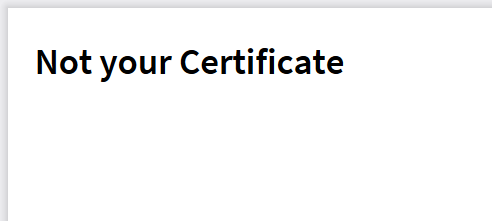

A few days ago, there was a link to 1Ci certificate in the team chat (a colleague passed their junior [course](https://academy.1ci.com/courses/1c-junior-developer)). I go over, I get a PDF. Everything is OK, right? Well, then I open the file:

Honestly, I am even delighted. We need to implement this UX in our products: you press, for example, the “print” button for a document, and it gives you a PDF! And inside it — a link to another PDF! And inside it — “entity is not filled”, so go fill.

You can sell it as a Russian way of dealing with errors. This is, like, for historical reasons! Blame all the damned matryoshkas, and [Koschei](https://en.wikipedia.org/wiki/Koschei) with his needle. It is, as you remember, in the egg, and it is in the duck, which is in the rabbit, tucked into the chest, and further along the chain of nesting.