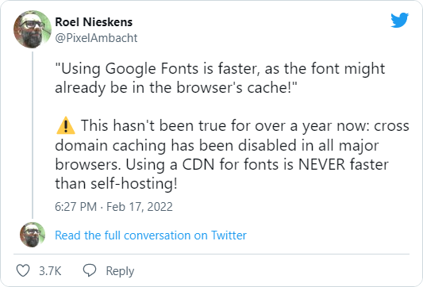



A year ago, damn it. Okay, hello everyone! Johnny Slowpoke is here! Today we will throw out Google Fonts from my blog. I used to load the main font (PT Sans) from this service, but it makes almost no sense without cross-domain caching. Frankly speaking, the only point to do this further is if a server on which the site is running is slow, so it is faster to load fonts from Google. 

I host my blog on GitHub servers and have no complaints about performance. So, I'm self-hosting PT Sans now, and you know what? The difference is dramatic. When updating a page before, there was clearly a noticeable delay between loading the page and loading the font. For now, it is barely recognizable. If you have a blog and want to try to self-host fonts — here is a cool [service](https://google-webfonts-helper.herokuapp.com/fonts) that solves the problem in a few clicks.

Don't forget to put a big, nice star on the [repository](https://github.com/majodev/google-webfonts-helper)!