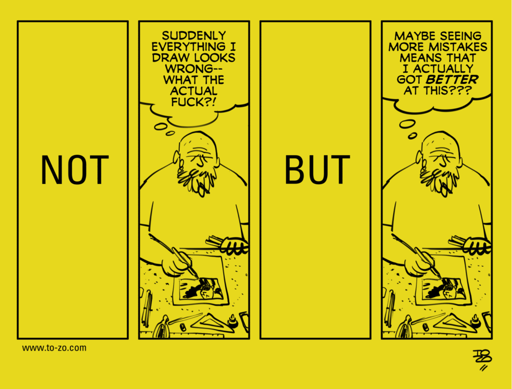

Someone told me about the Croatian comic [NOT/BUT](http://www.to-zo.com/notbut) at the beginning of last year, when I was seriously learning to draw. Each strip there is about some kind of traumatic or simply gloomy thought that comes into the artist’s head while working. The idea is to push a reader in the right direction and give them a more practical perspective on the situation they're in.

I quit drawing a year later, at the end of February: it became clear that I no longer had time for a hobby. But comics are completely universal; look through, even if you have no idea what a kneaded eraser is :-)

All these endless soul-searching are well known to any professional, and the way out of them is not always obvious. Especially if you are angry, tired, and the deadline for the project expired somewhere last week.