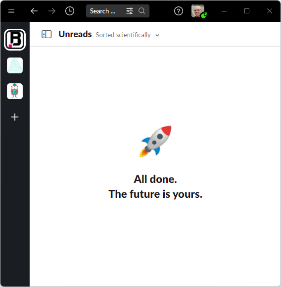
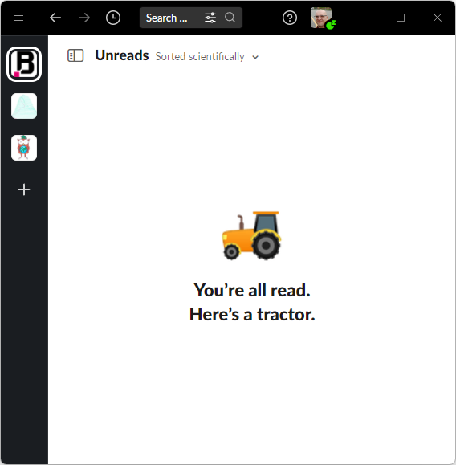

Slack, of course, is a thing to scold. For being slow, for having bugs, for notifications. But I just love his stubs in case there are no new messages.

Look at this cuteness:

Why do we need psychotherapists at all?

Or this:

Geez-Louise, Slack, hold on. You're not the first who advices this, believe me.